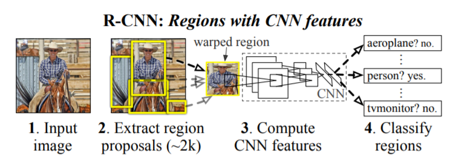
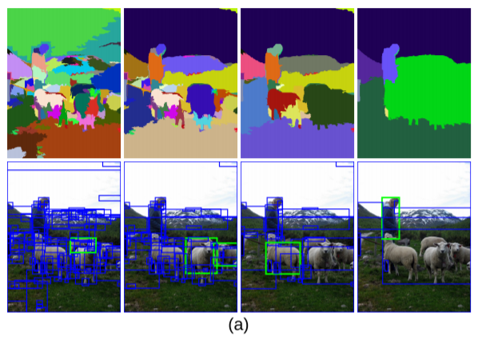
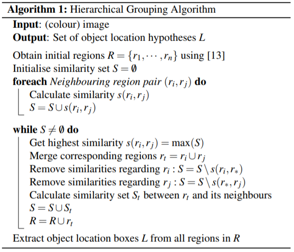
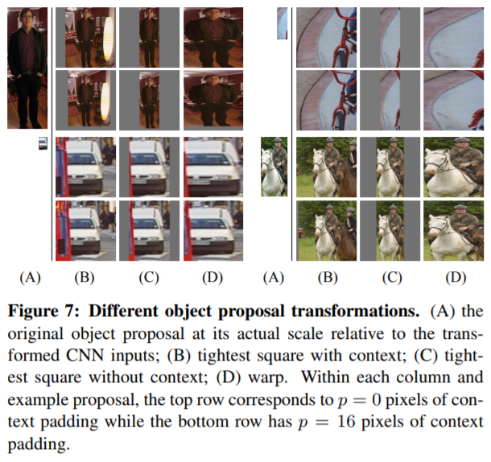
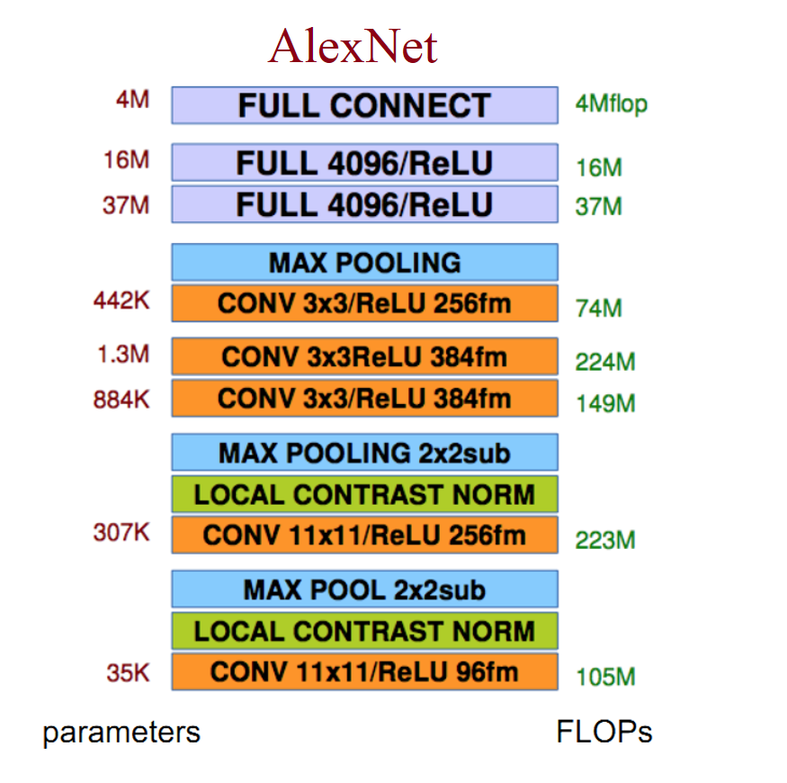
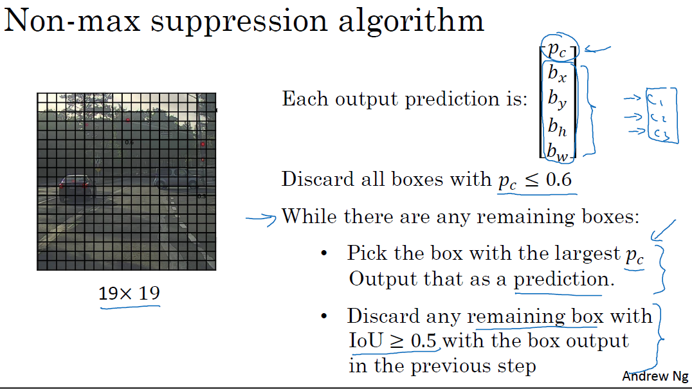
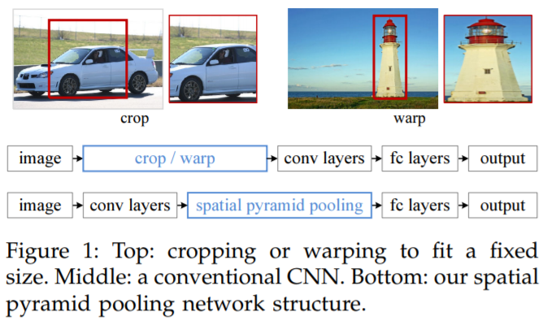
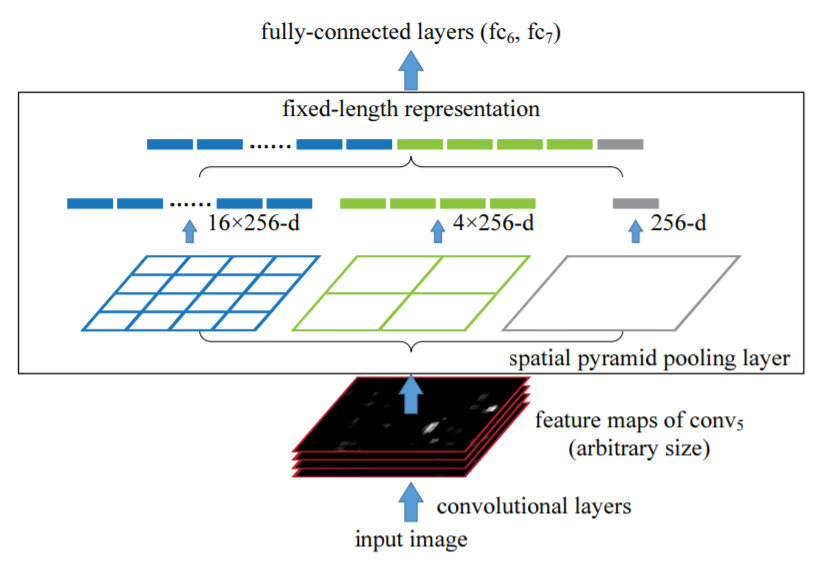

# 笔记: 目标检测之Faster RCNN系列

## 1. R-CNN基本框架

目标检测(Object detection)是计算机视觉领域的一个非常重要的研究问题。
相比于目标识别(Object classification)，目标检测还需要给出目标在图片中的位置。
一般来说，完成目标检测有两个大类的方法，比如one-stage方法，比如经典的YOLO系列算法，另一类就是two-stage的RCNN系列算法了。
目前也有一些综合了两类有点的算法。这篇笔记主要讲解RCNN系列的算法。

要找出目标的区域，一种蛮力算法是滑动窗口的方法。
对窗口位置和大小进行枚举，对每一个小块提取特征并分类，最后选择一个合适的位置。
这种做法显然无意义的计算过多，计算效率很低。

因此，R-CNN采用一种基于候选区域(Region proposal)的方法，大大降低需要考虑的区域，从而提高计算速度。

对于一张图片，显然不是所有的部分都需要考虑，我们可以按照某种规则生成一些最有可能有目标的区域，叫做Regions of Interest(RoI)，在这个选取的过程中叫做Region proposals。
这些候选区域的形状是任意的，因此需要经过变形，变成CNN的输入尺寸。经过CNN提取出features map。
最后，对每一个种类，使用一个简单的二分类器（比如SVM），计算该RoI的类别。

 

我们分别来考察这些过程的细节。

### (1) Region proposals

现在有很多种方法可以生成类别独立的Region proposal，我们详细讲解一种叫做Selective search的算法。下图是Selective search的效果。

Selective search是基于区域合并的的算法，可以看成一种特殊的层次聚类。

首先使用一种基于图的图像分割算法[3]，得到初始区域的集合R。对R中的每一对相邻区域，计算这对区域的相似度，得到相似度的集合S.
不断的从S中取出最大的相似度，和对应的区域，将其合并，并将对应区域原本的相邻相似度从S中去除，同时将新的区域和其相邻相似度加入R和S。
当S为空时，此时的R即为最后的region proposals。

可以注意到，R中包含了所有算法中出现的区域，包含了不同的层次。关于更详细的算法描述可以参考下图。

相似度为一系列距离的加和，包括颜色距离、纹理距离、区域吻合度、小区域优先级等。具体距离公式可参考原始论文[2]

RCNN使用该方法产生2000个候选区域。

 

### (2) 区域拉伸

候选区域的大小和宽高比并不固定，因此在送到卷积神经网络之前，需要拉伸到一个固定的大小。这个过程我们也有一些不同的方法可以选择。

上图给出了四个例子，每个例子分成上下两行以及B,C,D三列。

B列对应的方法是，将原本的候选区域的较短边，稍微往外扩展，然后等比例拉伸到合适大小，对空白区域填充候选区域的平均值。C列是等比拉伸，然后填充。D列是改变宽高比，直接拉伸到合适大小。

除此之外，拉伸前还可以设置一个参数p，用来指定padding的像素数。此时候选区域会先多获取p个像素的上下文padding，然后再运用上述的拉伸方法。

 

### (3) 特征提取

特征提取的网络结构其实可以是任意的，包括VGGNet，ResNet都可以应用到这一过程，原始论文使用的是大家很熟悉的AlexNet，结构如下图。

由于网络结构复杂，参数量很大，一般使用已经经过预训练的模型。原模型是在ImageNet上训练的，因此最后有1000个种类，现在改成N+1个种类，N是目标检测数据集（如PASCAL VOC）的类别数，额外的1表示背景。
从目标检测数据集中的图片提出候选区域，将与标签(ground truth)的IoU>0.5的区域作为正样本，其他作为负样本，对CNN进行训练，batch-size设为128，固定正样本数为32，负样本数为96。

网络结构中的每一层都可以作为RCNN的特征提取层，原始论文经过实验，发现使用fc7层（上图的倒数第二层）的特征，效果最好。

 

### (4) 目标分类器

提取到特征后，我们将特征输入到一系列的SVM二分类器中。我们仍然设置一个IoU的阈值0.3，将候选区域与标签的IoU>0.3的候选区域定义为正样本。这个阈值是经过试验后选出的最优阈值。
注意，这个阈值与微调CNN时的阈值有所不同。
训练SVM分类器的速度通常比较快。原始论文也尝试使用了softmax作为最后一层，发现效果远差于SVM。

 

### (5) 推断过程

在推断过程（Inference），先使用selective search生成候选区域，拉伸到适合CNN输入的大小。由CNN的前向过程计算特征。最后，对每个类，用这个类的SVM来打分，对每一个类，按照概率将候选区域排序，然后使用Non-maximum suppression选取最后的Region。

首先丢弃所有概率小于某个阈值的区域，然后对剩下的区域，选择一个最大的，并丢弃与选中的区域IoU大于某个阈值的区域。重复这个过程直到没有区域。选中的区域即为最后的结果。

### (6) Bounding box回归

经过上述过程产生的bounding box与我们的标签（ground truth）还是有一些误差的，我们可以通过训练一些回归器，减少这个误差。

对每一个类训练一个回归器，这个回归器接受一个bounding box $P=(P_x,P_y,P_w,P_h)$作为输入（中心坐标及宽高），产生一个修正后的bounding box $\hat{G}=(\hat{G_x}, \hat{G_y}, \hat{G_w}, \hat{G_h})$。

在训练时，回归器接受一系列的训练样本候选区域P和标签G，训练4个线性变换函数$(d_x(P), d_y(P), d_w(P), d_h(P))$的参数。这4个线性变换函数是对候选区域P的CNN的Pool5层（最后一个池化层）的特征，进行一个简单的线性变换，或者说点乘一个权重向量w.

最后的预测结果可表示为为
$$
    \hat{G_x}=P_wd_x(P)+P_x \\
    \hat{G_y}=P_hd_y(P)+P_y \\
    \hat{G_w}=P_w\exp(d_w(P)) \\
    \hat{G_h}=P_h\exp(d_h(P))
$$

损失函数为均方误差
$$
    L(P,G)=(t-w^T\phi_5(P))^2 \\
    t_x=(G_x-P_x)/P_w \\
    t_y=(G_y-P_y)/P_h \\
    t_w=\log(G_w/P_w) \\
    t_h=\log(G_h/P_h)
$$

加上参数的正则项，可以简单的使用反向传播算法进行训练。
  

## 2. SPP神经网络

R-CNN需要固定的输入尺寸，因此候选区域需要先进行裁剪或变形，这会损失很多信息，也会影响到最终模型的准确率。但是CNN中的卷积层本身并不要求输入尺寸固定，卷积核可以处理任意大小的图片，只有后面的全连接层需要固定的输入。

因此，我们可以通过一种叫做空间金字塔池化(Spatial Pyramid Pooling, SPP)的方法，来将不同尺寸的输入变换到一个固定的大小，从而可以连接到全连接层。

不需要变形的特点还有另一个优势，那就是现在只需要对整张图进行一次卷积操作，就可以通过候选区域的位置，直接找到卷积后的结果，这大大加快了R-CNN的速度。

我们分别来考察SPP的结构和将窗口映射到特征图的问题。

### (1) Spatial Pyramid Pooling

SPP的思想很简单。可以注意到池化操作没有权重，只要适当的调整池化的尺寸，就可以产生固定尺寸的输出。但这样的做法对小图片可行，对大图片就会丢失太多的信息。因此，SPP分成多个尺度进行池化，然后展开并拼接出一个固定大小的向量。

如上图，一张任意大小的图片在经过一系列的卷积层后，产生了256个特征图（最后一个卷积层有256个卷积核），大小不固定。对一张特征图，将特征图分别分成16, 4, 1份，做最大池化(max pooling)。处理完所有的特征图后，将池化结果进行拼接，得到的向量是固定长度的。在这个例子中，这个向量的长度为(16+4+1)x256.

### (2) 特征图映射

将图片映射到特征图实际上是将图片的角点映射到特征图。假设每一个卷积层都使用了$\lfloor p/2 \rfloor$大小的padding，p是卷积核的大小。

假设特征图中的一个点的位置为$(x',y')$，那么这个点在对应图像中的位置为$(Sx',Sy')$，其中S为各层中步长(stride)的累加。因此，对于一个区域，给定图像中的区域左上角的点，对应特征图中的位置为
$$
    x'=\lfloor x/S \rfloor + 1
$$
右下角的点，位置为
$$
    x'=\lfloor x/S \rfloor - 1
$$

  

## 3. fast R-CNN

## 4. faster R-CNN

-------

1. [Rich feature hierarchies for accurate object detection and semantic segmentation](https://arxiv.org/pdf/1311.2524.pdf)
2. [Selective Search for Object Recognition](https://www.koen.me/research/pub/uijlings-ijcv2013-draft.pdf)
3. [Efficient Graph-Based Image Segmentation](http://cs.brown.edu/people/pfelzens/segment/)
4. [ImageNet Classification with Deep Convolutional
Neural Networks](https://papers.nips.cc/paper/4824-imagenet-classification-with-deep-convolutional-neural-networks.pdf)
5. [Spatial Pyramid Pooling in Deep Convolutional
Networks for Visual Recognition](https://arxiv.org/pdf/1406.4729.pdf)