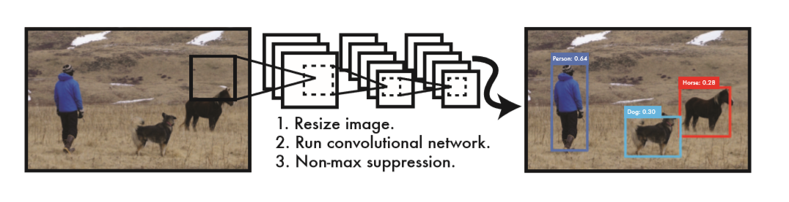
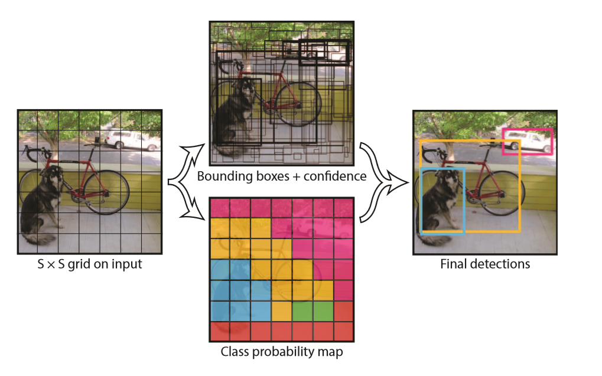
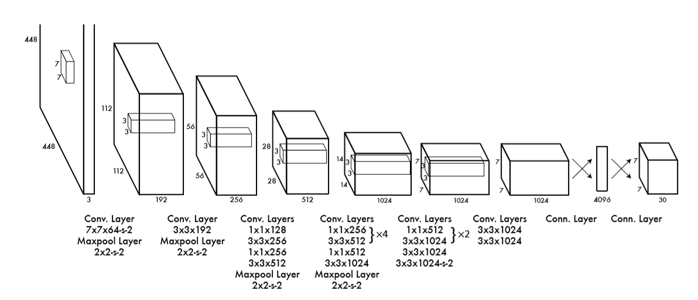
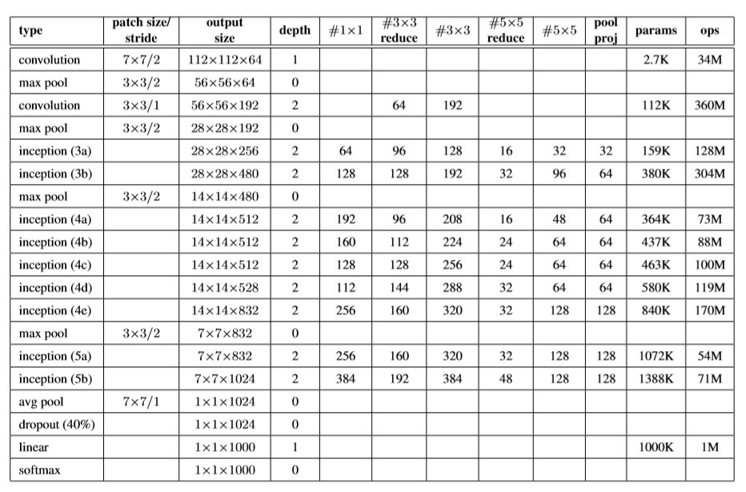
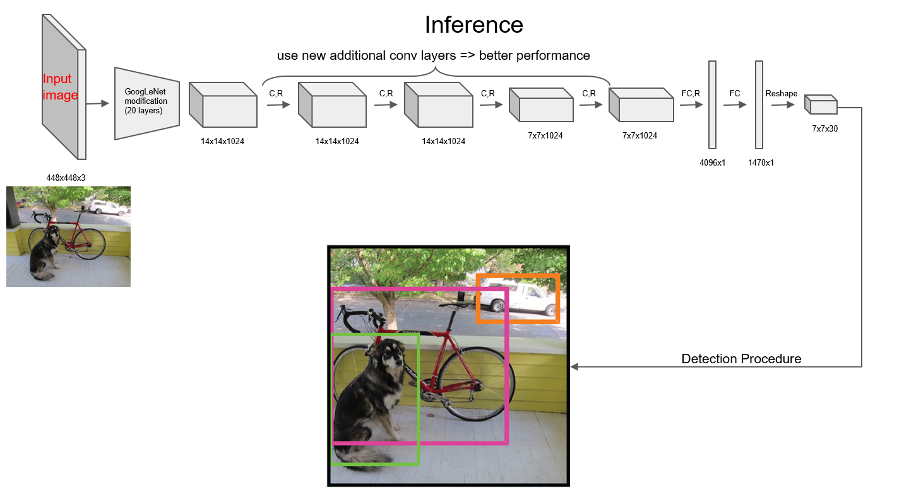
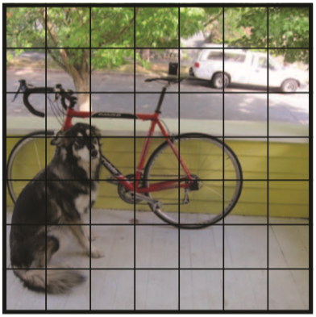
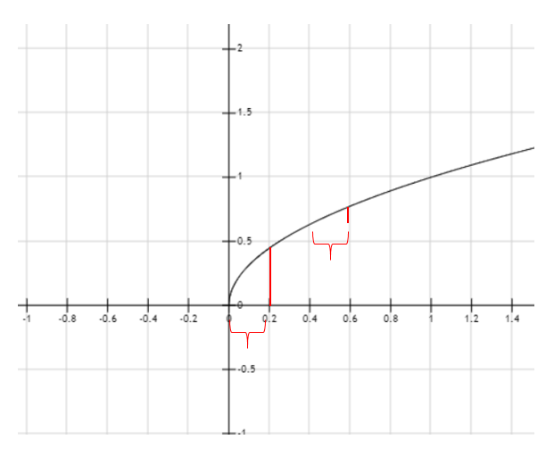

<font size=8>YOLO v1论文理解</font>

[TOC]

## 1    介绍

YOLO是一种目标检测方法，全称是You Only Look Once，不同于R-CNN系列的two-stage方法，YOLO没有显式的region proposal过程，而是将整个目标检测问题看作回归问题，使用单个卷积神经网络直接从完整图像预测出边界框和类别概率，YOLO进行目标检测的流程如下图。



<center>图1：（1）将图像大小调整为448&times;448</center>

<center>（2）整张图像作为输入传入一个卷积神经网络</center>

<center>（3）由模型的置信度对所得到的检测进行阈值处理</center>

所以YOLO具有下述特点：进行预测时由于没有复杂的流程，所以速度非常快，实时性能很好，对比其他实时系统则有很高的精度；YOLO在训练、预测时能完整知道整幅图的信息，相比Fast R-CNN，背景误检数量少了一半; 精度上会落后于最先进的检测系统，尤其对于较小的目标。

 

## 2    模型分析

### 2.1     整体思想

YOLO将输入的图像分成S&times;S个网格，只有当物体的中心落入某一网格时，该网格才对此物体负责，比如图2，只有狗中心点所在的网格才认为该网格内存在目标，而其他部分比如狗头所在的网格，虽然该网格内实际上有狗的一部分，但该网格仍然视作不存在目标。

每个网格预测B个边界框，这里的边界框和anchor box作用有点类似，有多个边界框能够匹配不同样式的目标，但不同点在于每个anchor box都有对应的所有类别概率，即多个anchor box在同一个网格可能包含多个不同的目标，而YOLO这里设置的是一个网格内，不管B取值是多少，只输出一组一共C个类别的条件概率 $Pr(Class_i|Object)$（C为类别数目，这里的条件概率指的是在存在目标的条件下该目标可能是类别i的概率）。即不管实际上可能有多个目标的中心点位于该网格，只假设该网格最多只含有一个目标，所以YOLO对于邻近目标的预测存在瓶颈，比如鸟群。

每个边界框包含5个预测值：x，y，w，h和置信度。其中(x、y)指边界框的中心相对于所在网格的坐标，将每个网格大小看作1&times;1，则x、y的范围为[0,1]。w, h为边界框相对于整个图像的长、宽，将整个图像大小看作1&times;1，则w、h的范围为[0,1]。

置信度的公式如下：
$$
Confidence = Pr(Object) * IOU^{truth}_{pred}
$$
即为网格存在目标的概率乘以预测的边界框与真实边界框的交并比。当网格内无目标时，$Pr(Object)$为0，此时置信度为0；当网格内有目标时，$Pr(Object)$为1，此时置信度即为IOU。

所以YOLO将图像输入卷积神经网络后的输出为S &times; S &times; (B &times; 5 + C），即一幅图像分成S&times;S个网格，每个网格包含C个类别的条件概率，以及B个边界框，每个边界框包含x、y、w、h以及置信度一共5个预测。YOLO论文中将图像分成7&times;7个网格，每个网格预测2个边界框，一共20个类别需要预测，所以输出为7 &times; 7 &times; (2 &times; 5 + 20) = 7&times;7&times;30 = 1470。  



<center>图2：YOLO系统将图像分成S&times;S个网格，每个网格输出B个边界框和置信度，以及C个类别条件概率。</center>

### 2.2     网络结构

YOLO的网络结构启发自GoogLeNet，有24个卷积层以及2个全连接层，将GoogLeNet的Inception结构调整为1&times;1的降维层以及后面跟着3&times;3的卷积层。



<center>图3：YOLO网络结构</center>

图4为GoogLeNet结构，可以对比图3来看。



<center>图4：GoogLeNet 结构，可以看出前20层和YOLO类似，只是GoogLeNet中inception module 被换成了 1&times;1的降维层和3&times;3的卷积层。</center>

对于前20层在ImageNet上进行了预训练，由于Ren等人表明，预训练网络中增加卷积层和全连接层可以提高性能，所以在前20层的基础上添加了4个卷积层和2个全连接层，这些层的权值使用随机初始化。由于检测问题需要细粒度的视觉信息，所以将输入的224&times;224调整为448&times;448在检测数据集上进行fine tune。



<center>图5：YOLO整体结构</center>

### 2.3     损失函数

损失函数应该是这篇论文中最难理解的部分，这部分做一个较详细的解读。
$$
\lambda_{coord}\sum^{s^2}_{i=0}\sum^B_{j=0}\mathbb{I}^{obj}_{ij}[(x_i-\hat{x_i})^2+(y_i-\hat{y_i})^2]\\
+\lambda_{coord}\sum^{s^2}_{i=0}\sum^B_{j=0}\mathbb{I}^{obj}_{ij}[(\sqrt{w_i}-\sqrt{\hat{w_i}})^2+(\sqrt{h_i}-\sqrt{\hat{h_i}})^2]\\
+\sum^{s^2}_{i=0}\sum^B_{j=0}\mathbb{I}^{obj}_{ij}(C_i-\hat{C_i})^2\\
+\lambda_{noobj}\sum^{s^2}_{i=0}\sum^B_{j=0}\mathbb{I}^{noobj}_{ij}(C_i-\hat{C_i})^2\\
+\sum^{s^2}_{i=0}\mathbb{I}^{obj}_{i}\sum_{c\in classes}(p_i(c)-\hat{p_i}(c))^2
$$
损失函数采用平方和误差的形式。便于理解，之后的公式说明以图6为例作为说明。$\mathbb{I}^{obj}_{ij}$ 为指示函数，表示当第i个网格内存在目标，且第j个边界框为该目标负责时后面的部分才有效。因为一共有7&times;7个网格，每个网格2个边界框，所以实际上有98个边界框，而图6中只有3个目标：狗、自行车、汽车，所以这里$\mathbb{I}^{obj}_{ij}$ 只有3个边界框起效果。而其中$\mathbb{I}^{noobj}_{ij}$ 表示当第i个网格内不存在目标，或第i个网格内存在目标，但第j个边界框不为该目标负责时后面部分才有效，以图6为例就是不包含目标的剩下的95个边界框。

 



<center>图6：图2中的输入图像</center>

$$
\lambda_{coord}\sum^{s^2}_{i=0}\sum^B_{j=0}\mathbb{I}^{obj}_{ij}[(x_i-\hat{x_i})^2+(y_i-\hat{y_i})^2]
+\lambda_{coord}\sum^{s^2}_{i=0}\sum^B_{j=0}\mathbb{I}^{obj}_{ij}[(\sqrt{w_i}-\sqrt{\hat{w_i}})^2+(\sqrt{h_i}-\sqrt{\hat{h_i}})^2]
$$

这两项表示的是边界框的坐标误差。考虑到分类误差如果和定位误差权重一样不是很合理，这里$\lambda_{coord}$为权重，值取5，使得定位误差的权重比分类误差的权重大。
$$
\lambda_{coord}\sum^{s^2}_{i=0}\sum^B_{j=0}\mathbb{I}^{obj}_{ij}[(x_i-\hat{x_i})^2+(y_i-\hat{y_i})^2]
$$
其中这一项表示的是含有目标的边界框预测的中心坐标$x$, $y$和真实值$\hat{x}$, $\hat{y}$的平方和误差，以图6为例就是那三个含有目标的边界框的(x,y)的平方和误差。
$$
\lambda_{coord}\sum^{s^2}_{i=0}\sum^B_{j=0}\mathbb{I}^{obj}_{ij}[(\sqrt{w_i}-\sqrt{\hat{w_i}})^2+(\sqrt{h_i}-\sqrt{\hat{h_i}})^2]
$$
这一项表示的是含有目标的边界框预测的长宽$w$,$h$和真实值$\hat{w}$,$\hat{h}$的平方根的平方和误差。以图6为例则同样是那三个含有目标的边界框起作用。为什么要使用$w,h$的平方根来处理，举例说明，是因为如果不这样处理，假设$h$和$\hat{h}$相等，$\hat{w}$为1，$w$为0.9 和 $\hat{w}$ 为0.2，$w$为0.1 的损失就会相同都为0.01，而实际上后者的损失远远比前者重要，因为同样的偏差，对于大边界框的重要性不如小边界框。所以这里使用了$w、h$的平方根,如图7所示。



图7：函数$y = \sqrt x$。在$h=\hat{h}$的情况下，比如$\hat{w}$为0.2，$w$为0时，损失约为0.202，而$\hat{w}$为0.6，$w$为0.4时，损失约为0.142，就能显示出小边界框的小偏差比之大边界框的小偏差的重要性。
$$
\sum^{s^2}_{i=0}\sum^B_{j=0}\mathbb{I}^{obj}_{ij}(C_i-\hat{C_i})^2
+\lambda_{noobj}\sum^{s^2}_{i=0}\sum^B_{j=0}\mathbb{I}^{noobj}_{ij}(C_i-\hat{C_i})^2
$$
这两项表示的是IOU的误差。$\lambda_{noobj}$这个为不含目标的IOU误差权重，值取0.5，因为实际上图中绝大多数边界框是不含目标的，如果不含目标和含目标的IOU误差权重一样，则会由于样本不均衡导致将所有的置信度都推向0，压过那些含有目标的边界框，使得模型不稳定而使训练不收敛。所以这里给不含目标的IOU误差以0.5的权重，使得含目标的IOU误差有更大的权重。
$$
\sum^{s^2}_{i=0}\sum^B_{j=0}\mathbb{I}^{obj}_{ij}(C_i-\hat{C_i})^2
$$
 这一项为含有目标的边界框的置信度也就是IOU的误差，以图6为例就是那三个含有目标的边界框的IOU误差。
$$
\lambda_{noobj}\sum^{s^2}_{i=0}\sum^B_{j=0}\mathbb{I}^{noobj}_{ij}(C_i-\hat{C_i})^2
$$
这一项为不含有目标的边界框的置信度的误差，以图6为例就是那95个不含有目标的边界框的置信度误差。
$$
\sum^{s^2}_{i=0}\mathbb{I}^{obj}_{i}\sum_{c\in classes}(p_i(c)-\hat{p_i}(c))^2
$$
这一项为含有目标的边界框的分类误差。

激活函数、神经网络优化算法以及其他相关超参数和数据增强方法都没有特别的地方，详见论文，这里不做赘述。

 

## 3    测试

论文中对测试阶段的处理基本没有提及，只是简单地提了下做了NMS处理。我这里参考了一些资料以及YOLO代码实现来简述下原理。

在输入图像经过卷积神经网络得到输出向量后，YOLO会做下述的处理：首先，将输出的每个网格的每个类别条件概率$Pr(Class_i|Object)$乘以对应网格里的每个边界框的置信度$Pr(Object) * IOU$， 也就是下列公式：
$$
Pr(Class_i|Object) * Pr(Object) * IOU_{pred}^{truth} = Pr(Class_i) * IOU_{pred}^{truth}
$$
乘后的值表示特定类别的置信度分数，既表示了类别$i$出现在边界框中的概率，又表示了预测的边界框和实际物体的匹配度。这样能得到一个[7,7,2,20]的向量。然后对特定类别的置信度分数进行判断，阈值设为0.2，去除所有小于0.2的分数，然后进行降序排序。这时先选取特定类别置信度分数最高对应的边界框，然后和其他分数对应的边界框分别计算IOU，如果IOU大于阈值0.5，那么就将该分数置为0，直到和其他所有边界框都计算IOU完毕为止，再选择分数第二高的边界框，与其他边界框分别计算IOU，进行同样操作即可。如果选取的边界框分数已经为0，则直接跳过。

对应的代码如下：

```python
for i in range(len(boxes_filtered)):
     if probs_filtered[i] == 0: continue
     for j in range(i + 1, len(boxes_filtered)):
         if self.iou(boxes_filtered[i], boxes_filtered[j]) > self.iou_threshold:
             probs_filtered[j] = 0.0
```

 

进行完NMS操作后，选取所有置信度不为0的边界框，输出对应的类别、框出对应的边界框即完成了测试和预测阶段的流程。


## 4  相关资料

论文地址：[You Only Look Once: Unified, Real-Time Object Detection](https://arxiv.org/pdf/1506.02640.pdf)

吴恩达deeplearning.ai[卷积神经网络部分](https://mooc.study.163.com/learn/2001281004?tid=2001392030#/learn/content)第三周内容有对目标检测组件包含YOLO的相关介绍

b站上有较详细分析YOLO v1的[中文视频](https://www.bilibili.com/video/av23354360?from=search&seid=2941001701015360142)

