YOLO v2 论文理解

[TOC]

# 1 介绍

YOLO v2是在YOLO v1的基础上进行了不少地改进的目标检测模型。在论文中，一部分主要介绍了相关的改进措施，使得YOLO v2模型在mAP和速度上相比YOLO v1得到了很大的提升。另一部分则是由于目标检测数据集相比分类数据集，数据量非常有限，所以提出了一种联合训练目标检测和分类的方法，在COCO检测数据集和ImageNet分类数据集上同时训练YOLO9000，使得其可以检测超过9000个不同的目标类别。

# 2 改进措施

YOLO v1存在的问题是相比最先进的目标检测系统精度比较低，会存在比较多的定位错误。与使用Region Proposal 策略的目标检测系统相比，召回率比较低。所以下述的改进措施主要为了改进召回率和定位，同时保持精度。

## 2.1 批量归一化

Batch Normalization应该都很熟悉了，这里简单介绍下。现代很多CNN模型都使用了Batch Normalization，能够使得神经网络更快地收敛，更容易训练，并起了一定正则化的作用，提高了模型的泛化能力。

做法大致如下，在对输入进行非线性映射前，也就是进入激活函数前，将输入减去均值除以标准差，使得变换后某个神经元的激活x形成了均值为0，标准差为1的正态分布，这样就把要进行的非线性变换向线性区拉动，防止梯度消失，加快训练收敛速度。由于这样将非线性变换拉到线性区，会使得网络表达能力下降，所以对变换后的激活进行了scale和shift，增强网络表达能力，如图1。

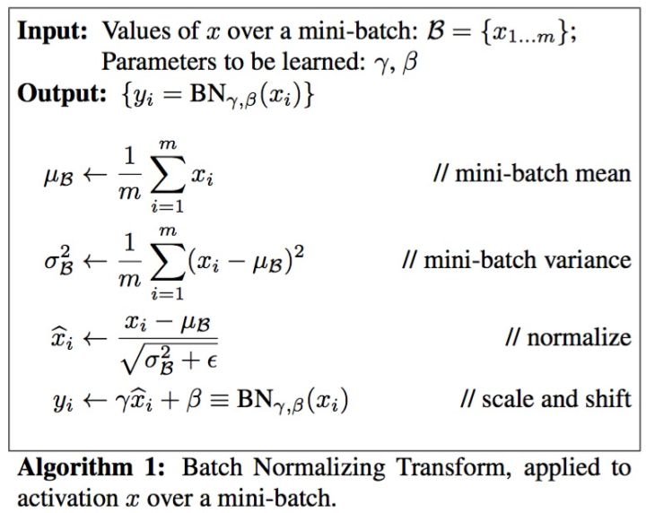

图1：Batch Normalization公式

YOLO v2使用了批量归一化后，加快了网络的收敛并一定程度避免了过拟合，所以也去掉了YOLO原先使用的Dropout层。通过这样的措施使得mAP提高了超过2%。

## 2.2 高分辨率分类器

之前YOLO v1的训练流程是先使用在ImageNet上预训练好输入为224&times;224图像的网络，然后将输入改为448&times;448，进行目标检测任务的Fine-tune，如图2所示。

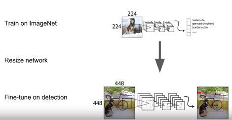

图2：YOLO v1训练流程

这样做神经网络需要同时去学习目标检测任务以及适应新的输入分辨率。所以YOLO v2采用的做法是使用在ImageNet上预训练好的输入为224&times;224图像的网络，将输入调整为448&times;448后仍然在ImageNet数据集上进行了10个epochs的Fine-tune，这样给神经网络时间去调整卷积核使得其在高分辨率的输入上工作得更好。然后再使用448&times;448的输入在目标检测数据集上进行Fine-tune，如图3所示。这样的措施使得mAP提高了接近4%。

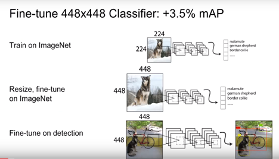

图3：YOLO v2训练流程

## 2.3 使用anchor box进行卷积

YOLO v1直接使用输出卷积层顶部的全连接层来预测边界框的坐标和长宽，而Faster R-CNN使用手动挑选的先验边界框，网络在特征图的每个位置预测anchor box的偏移值。预测偏移值而不是坐标使得问题更简化，也让网络更容易去学习。

然后考虑到最后的全连接层会丢失空间信息，而且目标检测问题和全局信息无关，更多的是目标周围局部的信息，所以YOLO v2移除了全连接层并使用anchor box来预测边界框。首先去除了一个池化层，使得输出的分辨率更高，这样更利于检测小物体。并且，由于YOLO的卷积层将图像下采样32倍，即输入为448&times;448时输出的特征映射为14&times;14，所以这里将输入从448&times;448调整为416&times;416，这样使得输出为13&times;13，使特征映射为奇数个，使得会有一个中心单元格，这样的好处是，目标尤其是大目标，会倾向于占据图像的中心，让一个中心单元格去预测该目标比让中心附近的四个单元格都可能负责预测该目标要更为容易。

相比YOLO v1一个网格含一组类别概率以及多个边界框，YOLO v2这里每个anchor box都含有一组类别概率，对比如下图所示。

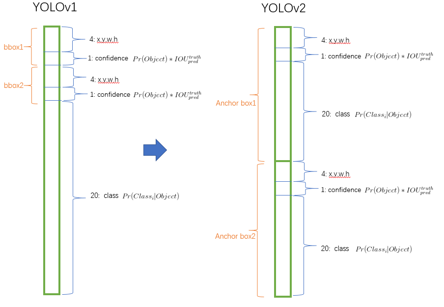

图4： YOLO v1和YOLO v2的输出对比

使用anchor box后m AP有一定的下降，因为YOLO v1只预测98个边界框，而使用anchor box则会预测超过1000个边界框（如果一个网格有9个anchor box的话数量为13 * 13 * 9 = 1521个），这使得召回率大大提升。没有使用anchor box时中间模型获得69.5 mAP，召回率为81％。使用anchor box时模型获得69.2 mAP，召回率为88％，虽然mAP少量减少，但召回率的增加意味着模型有更多的改进空间。

## 2.4 维度聚类

YOLO v2在使用anchor box时遇到了两个问题。一个问题是anchor box的维度（长宽）是手动选择的。网络确实能够学习去调整anchor box的维度，但如果能够选择更好的先验anchor box,那么就可以使网络更为容易地去学习。

这里在训练集上使用k-means聚类来自动地寻找好的先验anchor box而不是手动地挑选先验。如果使用传统的k-means，即用欧式距离来作为距离进行聚类，大的边界框会比小的边界框产生更多的错误（这里我是这样理解的，大的边界框之间长宽的欧式距离会明显比小边界框之间的欧式距离要大，于是就会有“大框优势”，即聚类中心会更倾向于大的边界框，比如k值为5时，可能产生4个大的边界框，1个小的边界框，这样这5个边界框可能不是能最好代表所有边界框的5个边界框），而YOLO v2希望选择的先验anchor box应该是能和其他边界框有较好的IOU，而和尺寸大小无关，所以这里的距离公式如下：
$$
d(box,centroid) = 1−IOU(box,centroid)
$$
即当前边界框和聚类中心边界框的距离是1减去两个边界框的交并比，也就是聚类中心能和该类的所有边界框拥有比较高的交并比。

YOLO v2测试了在VOC和COCO数据集下，不同k值以及对应的和最近中心的平均交并比如图5。

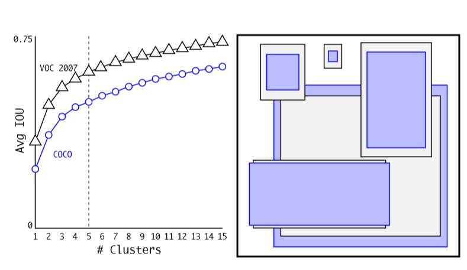

图5：VOC和COCO上的不同k值的平均IOU，以及找出的5个聚类中心

可以看出，k等于5是在模型复杂度和召回率上的一个较好的折中。聚类中心和手选的anchor box十分不同，有较少的短而宽的box，而有比较多的高而窄的box。

图6显示了在VOC 2007数据集上k=5使用欧式距离做聚类、k=5使用IOU为距离做聚类、手动挑选anchor box以及k=9使用IOU为距离做聚类的平均IOU。

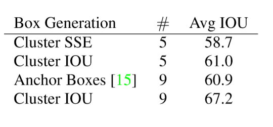

图6：不同策略平均IOU对比

可以看出，使用IOU为距离做聚类比手动挑选anchor box有更高的平均IOU，表明使用k-means生成anchor box使得以更好的表示开始模型，使得任务更容易去学习。

## 2.5 直接位置预测

使用anchor box遇到的第二个问题是模型不稳定，尤其在早期迭代中。大部分的不稳定来源于对box的(x,y)位置预测。在区域建议网络中，预测偏移值$t_x$和$t_y$以及中心坐标(x,y)的公式如下（原论文中误将加号写成减号）

$x = (t_x ∗w_a)+x_a\\
y = (t_y ∗h_a)+y_a$

$x_a,y_a, w_a, h_a$为anchor box的固定值。即当前预测的位置$x，y$，为原先anchor box固定值$x_a, y_a$加上偏移值$t_x,t_y$乘上$w_a,h_a$也就是进行尺度缩放后的值。

下图为Faster R-CNN的公式，其中带*的为真实值。

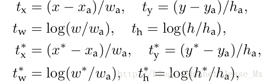

图7：Faster R-CNN区域建议网络公式

比如$t_x$为1，相当于往右移一个anchor box的宽度，为-1则是往左移一个anchor box的宽度。这样造成的问题是该公式是无约束的，就会出现无论在哪个网格进行预测，anchor box会最终出现在图像上的任何一处的问题，也就是可能会出现该网格负责预测的anchor box不在该网格上，而去到了很远的地方。所以使用随机初始化模型后需要很长时间才能稳定预测偏移。

所以YOLO v2使用类似YOLO中使用的方法，预测相对于网格的位置坐标。使用sigmoid函数来约束使得网络预测值在[0,1]内。

在输出的特征映射图中，每个网格预测5个边界框（根据上面维度聚类的结果），每个边界框输出5个值，坐标$t_x,t_y,t_w,t_h和置信度t_o$。如果当前网格距离图像左上角的距离为($c_x,c_y$），先验的anchor box的宽和高为$p_w,p_h$，则预测值公式如下：

$b_x = σ(t_x) + c_x\\
b_y = σ(t_y) + c_y\\
b_w = p_we^{t_w}\\
b_h = p_he^{t_h}\\
Pr(object)∗IOU(b,object) = σ(t_o)$

其中$b_x,b_y,b_w,b_h$是预测后的坐标值。$\sigma$为sigmoid函数，将偏移限制在[0,1]。图8用图像说明了该公式。

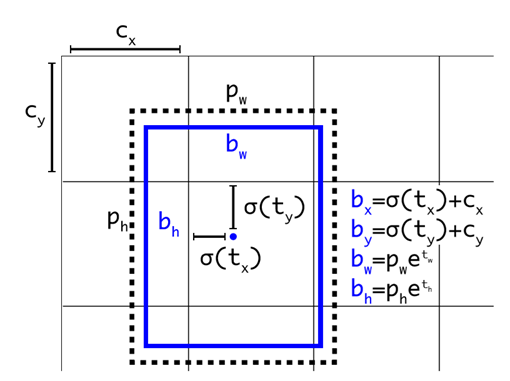

图8：box预测值公式图像表示

对位置预测进行约束后，参数更容易学习，也使网络更稳定。使用维度聚类以及直接位置预测后，相比之前使用anchor box的版本mAP提高了接近5%。

## 2.6 细粒度特征

修改后的YOLO模型输出一个13&times;13的特征映射，这对于比较大的目标来说是足够了，但对于定位小的目标来说或许可以从更细粒度的特征中收益。Faster R-CNN和 SSD在不同的特征映射上产生区域建议，获得多尺度的适应性，YOLO v2则采用了类似ResNet Identity mapping的策略，比如将较早的一层特征映射26&times;26&times;512先隔行隔列采样成4个13&times;13&times;512的特征映射，然后拼接起来形成13&times;13&times;2048的特征映射，当后面一层的特征映射为13&times;13&times;1024时，就和后面一层的特征映射在通道数上进行叠加，形成13&times;13&times;3072的特征映射。这样能够提供更细粒度的特征，通过这样的措施，mAP提高了接近1%。

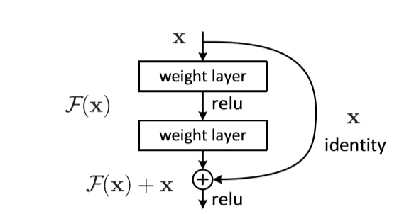

图9：ResNet恒等映射结构

## 2.7 多尺度训练

YOLO v2还采用了多尺度训练，训练时，在网络结构完全不变的情况下，每10个batches网络就在以32为增量的{320，352，……，608}中随机选择一个新的输入图像维度来进行训练，如图10。这样可以让YOLO v2对于不同尺度的图像拥有健壮性，同样的网络可以对不同分辨率的图像进行检测，也相当于数据增强的作用，使得数据集能够得到扩充，来尽量避免过拟合。通过这样的措施，能够增加接近1.5%的mAP。

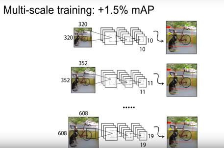

图10：多尺度训练

图11为YOLO v2在VOC数据集上不同尺度图像的表现，较低分辨率图像时，比如图像大小为288&times;288，能够获得与Fast R-CNN接近的mAP而超过90FPS。在高分辨率下，YOLO v2是一种最先进的检测器，在VOC 2007上具有78.6 mAP，同时仍然在实时速度以上运行。YOLO v2提供了精度和速度的简单权衡。

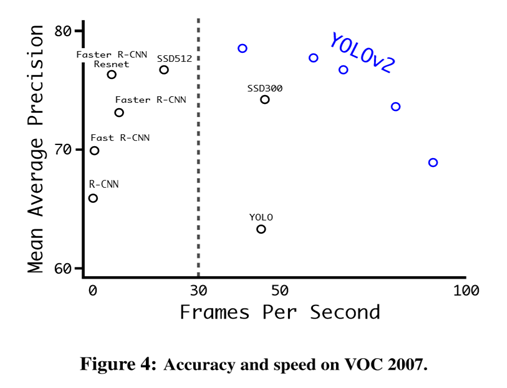

图11：不同输入尺度下的YOLO v2的m AP与FPS

图12为YOLO做了上述的改进措施后获得的mAP提高。

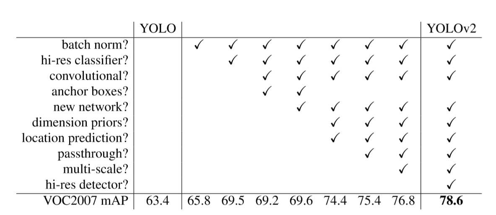

图12：YOLO到YOLO v2的改进措施及mAP提高

## 2.8 速度提升

在希望目标检测更精准的同时，YOLO v2也希望更加得快速。大多数检测网络基于VGG-16，但VGG网络拥有非常多的浮点数运算，复杂度比较冗余。YOLO v1基于的GoogLeNet比VGG-16要快，浮点数运算也要少于VGG-16，但准确度会比VGG-16要差。

YOLO v2采用了一个叫Darknet-19的模型，拥有19个卷积层和5个最大池化层，结构如图13，借鉴了VGG,用了很多3&times;3的卷积核。

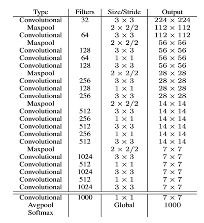

图13：Darknet-19结构

先对分类进行训练，输入大小为224&times;224，在ImageNet上使用随机梯度下降法，进行了160个epochs的训练，然后按之前提及的方法将输入大小改为448&times;448，再训练10个epochs。然后对目标检测进行训练时修改了上述的网络结构，去掉了原网络最后一个卷积层，增加了三个3&times;3&times;1024的卷积层，并且在每一个上述卷积层后面跟一个1&times;1的卷积层，输出维度是检测所需的数量。对于VOC数据集，预测5种boxes大小，每个box包含5个坐标值和20个类别，所以总共是5 &times;（5+20）= 125个输出维度。同时也添加了上文介绍的类似ResNet的转移层，从最后那个3 &times;3 &times; 512的卷积层（图13中第13个卷积层）连到倒数第二层（也就是增加那三个3&times;3&times;1024的卷积层第二个），使模型有了细粒度特征。训练的其他超参数的细节不做赘述。

# 3 YOLO9000

论文提出了一个关于分类和检测数据的联合训练机制。因为分类数据集的数据量远远大于检测数据集的数据量如图14，所以如果能利用好分类数据集的数据，会使检测系统更加的强大。

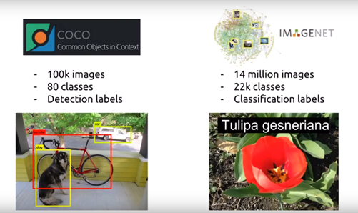

图14：目标检测与分类数据集对比

这里采用了将分类和检测数据集共同训练的方法，会遇到几个挑战。由于检测数据集只含有较常用的目标和标签，类似于“狗”和“船”，而分类数据集会有更宽和更深的标签范围，比如ImageNet就含有超过一百多种的狗，包括“Norfolk terrier”, “Yorkshire terrier”, and “Bedlington terrier”等，如果直接使用Softmax层，那有一个前提是假设类是互斥的，而如果组合coco和ImageNet数据集，那么狗和猎犬显然不是互斥的，所以此时要使用分层分类方法。

ImageNet的标签是从WordNet提取的，在WordNet中，“Norfolk terrier”, “Yorkshire terrier”在“terrier”类别下，而“terrier”在“dog”类别下。WordNet被构造为有向图，而不是一个树，因为一个类可能是多个类别的子类，比如狗属于犬也属于家畜。所以这里需要从ImageNet中构造成树来简化问题。ImageNet在WordNet的根节点是物理对象，将所有只有单条路径的加入树中，为了使树尽量小，在一个类别含多条路径时，选择更短的一条路径。图15显示了COCO、ImageNet数据集以及最终组合成的WordTree。

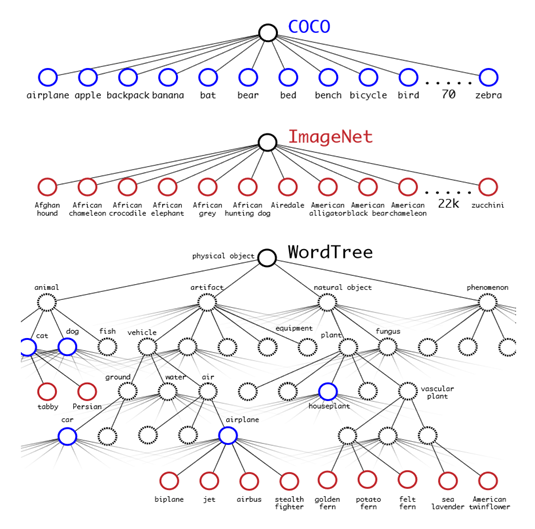

图15：COCO、ImageNet以及组合成的WordTree

基于WordTree,如图16所示，不是所有类别共用一个Softmax，而是一个类别的在同一层次下的所有子类别使用一个Softmax。

图16：Softmax在ImageNet和WordTree上的使用

对于分类图像，我们假设图像包含一个物理目标，$Pr(physical\ object) = 1$，此时要计算特定节点的绝对概率，只需遵循通过树到达根节点的路径，并乘以条件概率。比如计算Norfolk terrier的绝对概率：

$Pr(Norfolk\ terrier) =Pr(Norfolk\ terrier|terrier) ∗Pr(terrier|hunting\ dog)\\ ∗...∗ Pr(mammal|animal) ∗Pr(animal|physical\ object)$

训练时，如果是检测数据集中的图像，则在反向传播过程中返回完整的损失，而如果是分类数据集中的图像，由于只有类别的标签，所以只返回分类错误。如图17。

通过这样的措施，使得YOLO9000能检测9000个以上的类别。

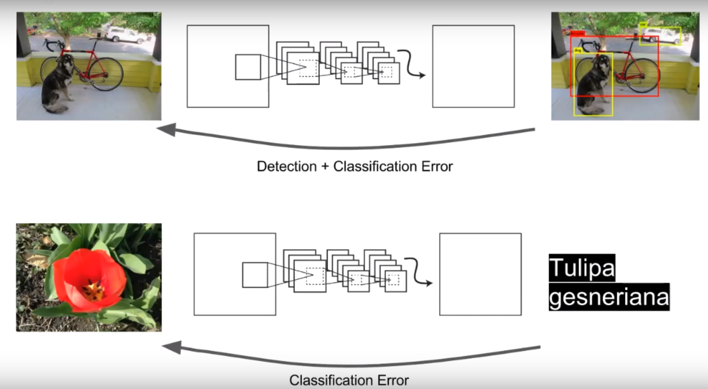

图17：检测图像和分类图像在反向传播时的差别

# 4 相关资料

论文地址：[YOLO9000: Better,Faster,Stronger](https://arxiv.org/pdf/1612.08242.pdf)

youtube上有英文[相关视频资料](https://www.youtube.com/watch?v=GBu2jofRJtk)介绍